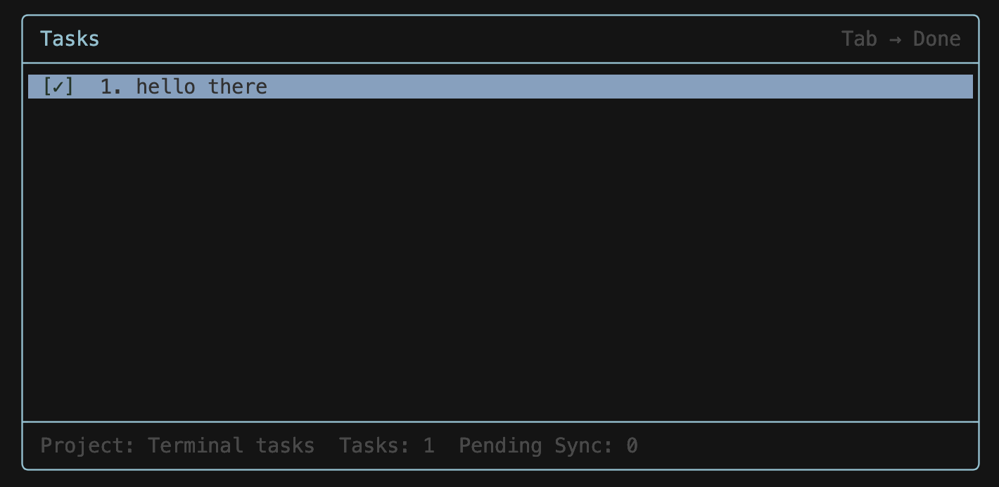

# Terminal Todo

**A terminal TODO Application built on (T)RUST**



If you spend an abnormal amount of time in the terminal and do not want to switch between apps to add tasks, you found the right shit.

---

## Installation

Make sure Rust is installed first:

```bash
curl --proto '=https' --tlsv1.2 -sSf https://sh.rustup.rs | sh
```

Clone and install:

```bash
git clone <your-repo-url>
cd learn-rust
cargo install --path .
```

The `todo` binary will be available in `~/.cargo/bin` (usually already in your PATH).

---

## How To Use

Quickly add a task from anywhere:

```bash
todo Buy groceries
todo Review logs from production
```

Open the TUI:

```bash
todo
```

Inside the TUI you can:
- browse tasks
- open and read task details
- add/edit descriptions
- mark tasks done/undone
- delete tasks
- refresh/switch projects when TickTick is connected

Press `h` in the TUI to toggle and view all key commands.

---

## Keep It Always Open (tmux)

If you use `tmux`, keep a dedicated pane/session running `todo` all the time so your task list is always one keybind away.

---

## TickTick Cloud Sync

Want cloud sync so tasks are available anywhere? Connect once:

```bash
todo ticktick connect
```

After connecting, your tasks sync with TickTick cloud, and you can continue working from terminal while still seeing tasks across devices/apps.
